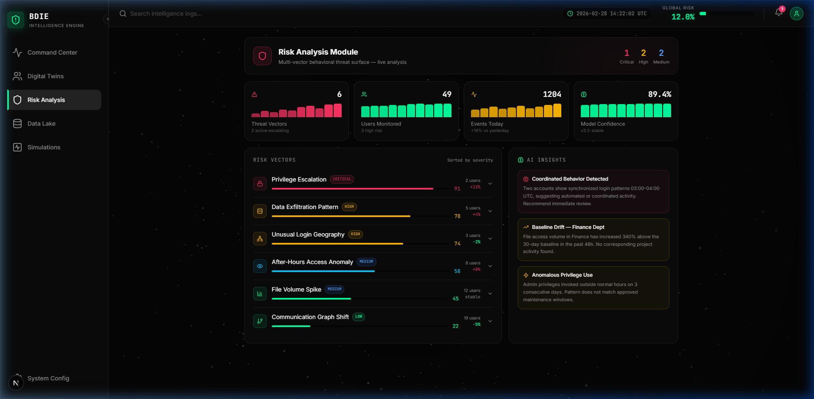
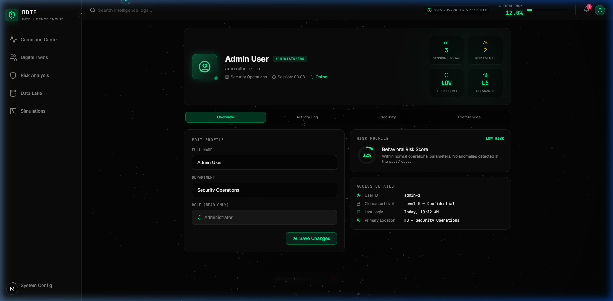
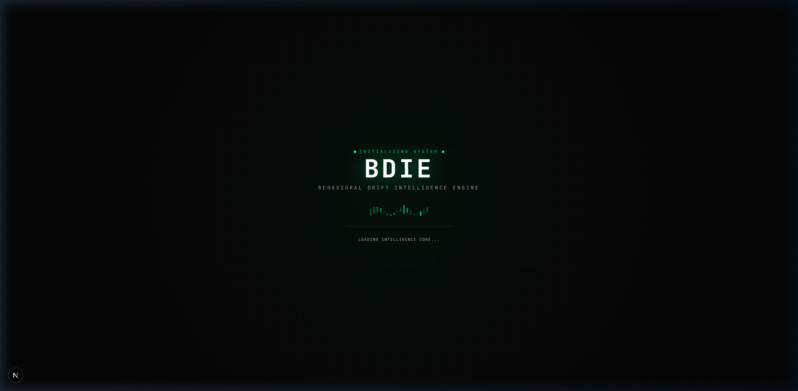
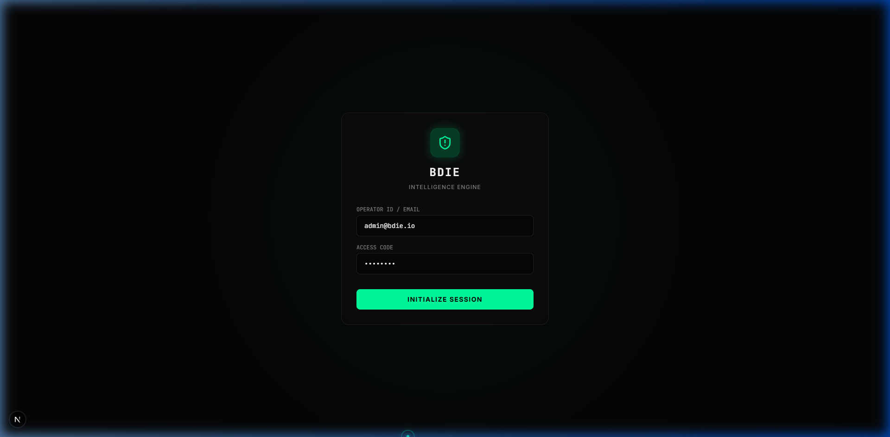

<div align="center">


# 🔬 BDIE — Behavioral Drift Intelligence Engine

**An AI-powered insider threat detection platform with real-time behavioral analysis, 3D digital twin visualization, and predictive risk scoring.**

[](https://nextjs.org/)
[](https://react.dev/)
[](https://www.typescriptlang.org/)
[](https://threejs.org/)
[](https://www.docker.com/)

</div>

---

## ✨ Features

- **🧠 Intelligence Command Center** — Real-time behavioral drift analysis with animated time-travel slider
- **🔮 3D Digital Twin** — WebGL sphere that morphs and changes color based on live risk score
- **📈 Predictive Risk Graph** — Historical + future forecast chart with confidence bands
- **🚨 Smart Alert System** — Auto-triggers critical banners when risk score exceeds threshold
- **⚡ Simulation Engine** — Run privilege escalation, data hoarding, and suspicious login scenarios
- **👤 Rich Profile Page** — 4-tab user dashboard (Overview, Activity Log, Security, Preferences)
- **⚙️ System Configuration** — Live sliders for AI model tuning, system health monitoring
- **📊 Risk Analysis Module** — Expandable risk vector table with AI threat insights
- **🖱️ 144Hz Custom Cursor** — Spring-physics ring cursor with Bézier ribbon trail
- **🎬 AnimeJS Loading Screen** — Cinematic startup animation with equalizer bars

---

## 🖼️ Screenshots

<table>
  <tr>
    <td><strong>Command Center (Dashboard)</strong></td>
    <td><strong>Risk Analysis</strong></td>
  </tr>
  <tr>
    <td></td>
    <td></td>
  </tr>
  <tr>
    <td><strong>Operator Profile</strong></td>
    <td><strong>System Configuration</strong></td>
  </tr>
  <tr>
    <td></td>
    <td></td>
  </tr>
  <tr>
    <td colspan="2" align="center"><strong>Secure Authentication</strong></td>
  </tr>
  <tr>
    <td colspan="2" align="center"></td>
  </tr>
</table>

---

## 🚀 Quick Start

### Prerequisites

| Requirement | Version |
|-------------|---------|
| Node.js     | ≥ 20    |
| npm         | ≥ 10    |
| Docker      | ≥ 24 *(optional)* |

---

### Option 1 — Local Development

```bash
# 1. Clone the repository
git clone https://github.com/your-username/behavioral-drift-intelligence-engine.git
cd behavioral-drift-intelligence-engine

# 2. Install dependencies
npm install

# 3. Start the development server
npm run dev
```

Open [http://localhost:3000](http://localhost:3000) in your browser.

**Default login credentials:**

| Field    | Value           |
|----------|-----------------|
| Email    | `admin@bdie.io` |
| Password | `password`      |

---

### Option 2 — Docker (Recommended for Production)

```bash
# 1. Clone the repository
git clone https://github.com/your-username/behavioral-drift-intelligence-engine.git
cd behavioral-drift-intelligence-engine

# 2. Build and run with Docker Compose
docker compose up --build -d

# 3. Open the app
open http://localhost:3000

# View logs
docker compose logs -f bdie

# Stop
docker compose down
```

**Or build/run without Compose:**

```bash
docker build -t bdie .
docker run -p 3000:3000 -d --name bdie-app bdie
```

---

## 🗂️ Project Structure

```
behavioral-drift-intelligence-engine/
├── app/
│   ├── (dashboard)/          # Authenticated route group
│   │   ├── dashboard/        # Command Center
│   │   ├── analysis/         # Risk Analysis Module
│   │   ├── profile/          # User Profile (4 tabs)
│   │   └── settings/         # System Configuration
│   ├── api/
│   │   ├── auth/             # Login / Me / Logout endpoints
│   │   └── notifications/    # Notification API
│   └── login/                # Authentication page
├── components/
│   ├── dashboard/            # MainDashboard, PredictiveGraph, DigitalTwin, etc.
│   ├── layout/               # Sidebar, Topbar, RightPanel
│   ├── three/                # WebGL BackgroundSystem
│   └── ui/                   # CustomCursor, LoadingScreen, SmartAlertBanner
├── store/
│   └── useAppStore.ts        # Zustand global state
├── data/                     # JSON database (file-based persistence)
├── public/screenshots/       # README screenshots
├── Dockerfile
├── docker-compose.yml
└── .dockerignore
```

---

## 🛠️ Tech Stack

| Layer | Technology |
|-------|-----------|
| Framework | Next.js 15 (App Router) |
| Language | TypeScript 5.9 |
| UI | React 19, Tailwind CSS v4 |
| 3D Graphics | Three.js r183, @react-three/fiber, @react-three/drei |
| Animation | AnimeJS v4, Framer Motion (motion) |
| Charts | Recharts 3 |
| State | Zustand 5 |
| Icons | Lucide React |
| Database | JSON file-store (dev) / MongoDB (prod, optional) |

---

## ⚙️ Environment Variables

Create a `.env.local` file in the root (optional):

```env
# Optional: MongoDB connection string (falls back to JSON DB if not set)
MONGODB_URI=mongodb://localhost:27017/bdie

# Disable Next.js telemetry
NEXT_TELEMETRY_DISABLED=1
```

---

## 📦 Available Scripts

```bash
npm run dev      # Start development server (http://localhost:3000)
npm run build    # Build production bundle
npm run start    # Start production server
npm run lint     # Run ESLint
```

---

## 🔒 Security Notes

- All dashboard routes are protected via middleware — unauthenticated users are redirected to `/login`
- Auth token stored as an `httpOnly` cookie
- Default credentials are for **demonstration only** — change before deploying to production
- The JSON database in `/data` is suitable for demos; use MongoDB for production workloads

---

## 🐳 Docker Notes

The Dockerfile uses a **3-stage multi-stage build**:

1. **deps** — installs npm dependencies (layer-cached on `package.json`)
2. **builder** — runs `next build` with standalone output mode
3. **runner** — minimal Alpine image (~150 MB), runs as non-root user

```bash
# Check container health
docker inspect bdie-app --format='{{.State.Health.Status}}'

# Shell into the container
docker exec -it bdie-app sh
```

---

## 📄 License

MIT © 2026 BDIE Project

---

<div align="center">
  <sub>Built with Next.js · Three.js · AnimeJS · Zustand · Tailwind CSS</sub>
</div>
