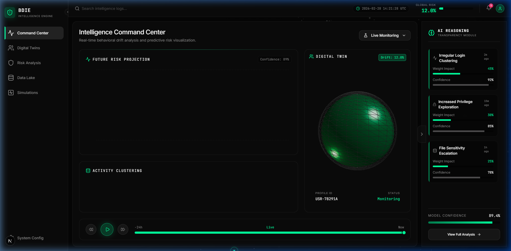

<div align="center">



# 🔬 BDIE — Behavioral Drift Intelligence Engine

**A production-grade, enterprise-scale insider threat detection platform. Featuring real-time behavioral analysis, weighted risk scoring, 3D digital twin visualization, and AI-driven explainability.**

[](https://nextjs.org/)
[](https://react.dev/)
[](https://www.typescriptlang.org/)
[](https://www.mongodb.com/)
[](https://jwt.io/)
[](https://www.docker.com/)

</div>

---

## ✨ Features

- **🛡️ Enterprise Authentication** — Secure JWT-based auth with Access (15m) and Refresh (7d) tokens, bcrypt hashing, and account lockout protection.
- **👥 RBAC User Management** — Role-Based Access Control with defined permissions for **Admin**, **Analyst**, and **Viewer** roles.
- **🧠 Advanced Risk Engine** — Weighted scoring algorithm analyzing 5 behavioral vectors: Login Anomaly, Privilege Escalation, File Access, Data Volume, and Tone Shift.
- **📉 Behavioral Drift Index** — Real-time Euclidean distance calculation comparing current behavior against an established user baseline.
- **🔮 AI Explainability Layer** — Factor-based risk breakdown with percentage contributions and historical trend snapshots.
- **⚡ Simulation Pipeline** — Industrial-standard simulation of attack scenarios (Data Hoarding, Privilege Escalation, etc.) with persistent DB logs.
- **📦 Digital Twin Visualization** — 3D WebGL model dynamically linked to real-time risk scores and behavioral state.
- **🚨 Contextual Notifications** — Severity-based alerts with persistent state and click-to-nav context links.
- **📝 Audit Trail** — Immutable audit logs for all administrative and automated actions within the system.

---

## 🚀 Quick Start

### Prerequisites

- **Node.js**: ≥ 20.0
- **MongoDB**: Local instance or Atlas Cluster
- **Docker**: Optional (for containerized deployment)

---

### Installation & Local Setup

```bash
# 1. Clone & Enter
git clone https://github.com/your-username/bdie-saas.git
cd bdie-saas

# 2. Install Production Dependencies
npm install

# 3. Configure Environment
cp .env.example .env.local
# Edit .env.local with your MONGODB_URI and JWT secrets
```

### Development

```bash
npm run dev
```

Open [http://localhost:3000](http://localhost:3000).

---

## 🗂️ Project Structure

```
bdie/
├── app/
│   ├── (dashboard)/     # Authenticated Route Group (Protected)
│   ├── api/             # production-grade API routes (RBAC + Validation)
│   └── login/           # Auth Portal
├── components/
│   ├── dashboard/       # Risk Charts, User Tables, Metrics
│   ├── layout/          # Sidebar, Topbar, ThemeProvider
│   ├── three/           # Digital Twin & Background System
│   └── ui/              # Reusable Radix/Tailwind components
├── lib/                 # Core Engine Logic (Risk, Simulation, Explainability, Auth)
├── middleware/          # Next.js & API middleware (JWT, RBAC, Rate Limiting)
├── models/              # Mongoose Production Schemas (User, RiskSnapshot, AuditLog, etc.)
├── store/               # Zustand Global State
├── animations/          # Anime.js & Framer Motion orchestration
└── public/              # Static Assets & Screenshots
```

---

## 🛠️ Tech Stack

| Layer | Technology |
|-------|-----------|
| **Frontend** | Next.js 15 (App Router), TypeScript 5.9, Tailwind CSS v4 |
| **Backend** | Next.js API Routes, Node.js |
| **Database** | **MongoDB Atlas** (Mongoose ODM) |
| **Auth** | **JWT** (jsonwebtoken), **bcryptjs** |
| **State** | Zustand 5 |
| **Graphics** | Three.js (r183), @react-three/fiber |
| **Animation** | AnimeJS v4, Framer Motion |
| **Validation** | **Zod** (schemas), express-rate-limit (LRU) |
| **DevOps** | Docker (Multi-stage), Vercel/AWS Ready |

---

## ⚙️ Environment Variables

Required variables in `.env.local`:

```bash
MONGODB_URI=mongodb+srv://...           # MongoDB Connection String
JWT_ACCESS_SECRET=your_secret_here      # Min 64 chars
JWT_REFRESH_SECRET=your_secret_here     # Min 64 chars
JWT_ACCESS_EXPIRES_IN=15m
JWT_REFRESH_EXPIRES_IN=7d
ENABLE_REGISTRATION=true                # Set false in production
```

---

## 🔒 Security & Performance

- **Rate Limiting**: Integrated per-IP rate limiting (5 req/min for auth, 100 req/min for API).
- **Sensitive Data**: Password hashes and tokens are never returned in API responses.
- **Input Validation**: All API endpoints use strict Zod schema validation.
- **Database**: Optimized with compound indexes for time-series risk queries and TTL collection purging for logs.
- **Routing**: Next.js Edge Middleware enforces authentication before page rendering.

---

## 🐳 Docker Deployment

Building the production container:

```bash
docker build -t bdie-prod .
docker run -p 3000:3000 --env-file .env.local bdie-prod
```

---

## 📄 License

Internal Use - Corporate License © 2026 BDIE Enterprise.

---

<div align="center">
  <sub>Built for Security Professionals by the BDIE Team</sub>
</div>
